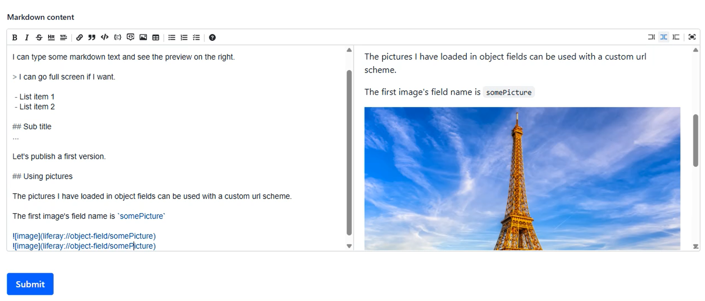

# Markdown editor and renderer for Liferay Objects

Click the picture below to download a demo video:

[](
https://raw.githubusercontent.com/fabian-bouche-liferay/markdown-editor/master/doc/markdown-cx.mp4
)

## How to

Deploy the client extension `blade gw clean deploy`

Create the two fragments described in the fragment directory.

 - One is the markdown editor, a form fragment
 - The other one is a regular fragment, to render Markdown

Works against Liferay objects where markdown is written to a Long Text field.

## Create the custom fragments

See under the `/fragments` folder of this repo.

 - `markdown-textarea` is a custom **Form Fragment** which you will associate with the **Long Text** field type.
 - `markdown-renderer` is a custom **Basic Fragment** used to render Markdown to HTML.

## Custom url schemes for pictures

### Picture from an object field

```

```

Where `objectFieldName` is the name of the object field which contains a picture (attachment type).

### Picture from the document library

```

```

Where `externalReferenceCode` is the ERC of the document from the site's document library.

It's limited to documents from the current site for the moment.

## Required permissions

For each object field with an image, the viewer must have the associated Download permission.


And in addition to that, we have to give `Guest` the `View` permission against the object definition.


The reason is there is a required call to dynamically get the `restContextPath` of the Object Definition so as to call the Object's REST API.
